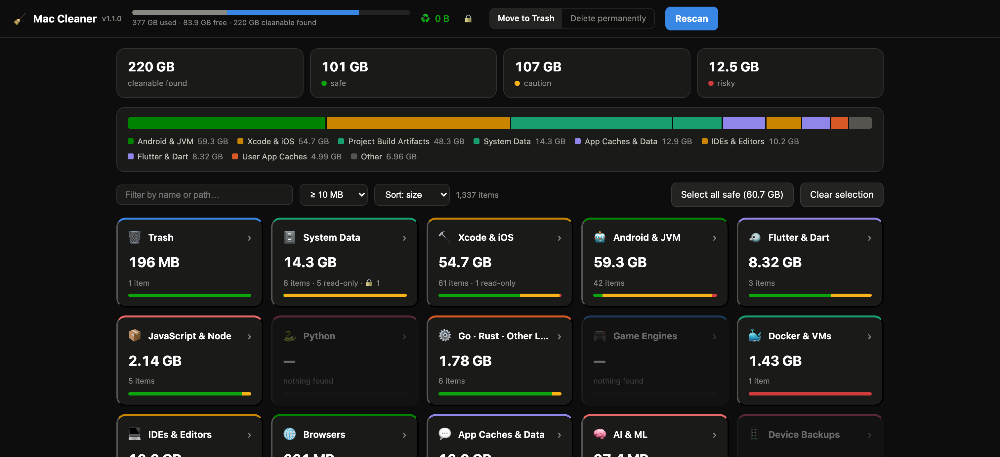
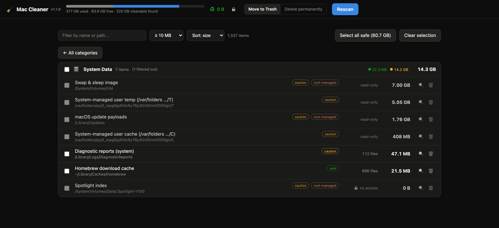
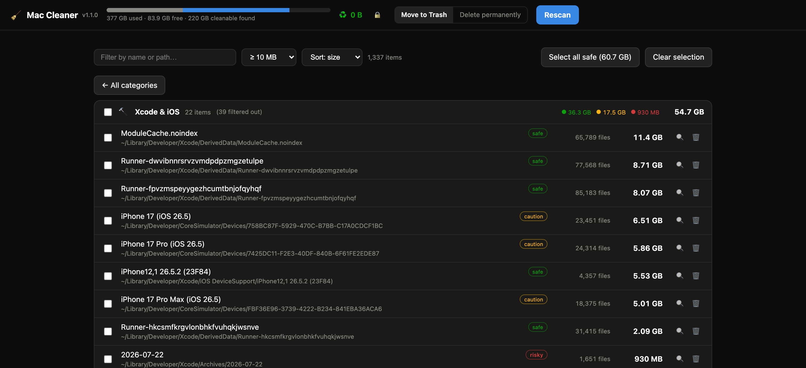
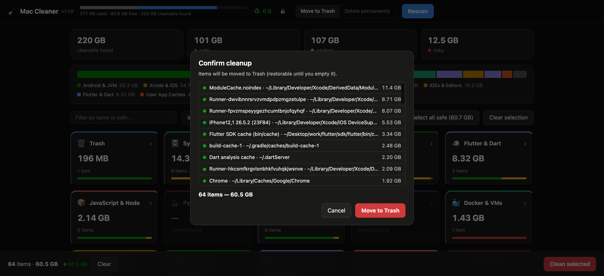
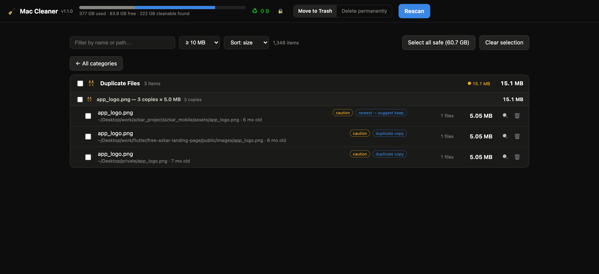

<div align="center">

# 🧹 Mac Cleaner

**Find what is eating your disk. Delete only what you choose.**

A local, **zero-dependency** disk-cleanup tool for developer Macs — usable as a native
**Mac app** (`.dmg` download) *or* as a **local web dashboard** run from source.
It scans developer caches, build artifacts, **System Data**, large files and installer
leftovers, classifies every item by safety, and lets you delete manually.
Nothing is ever deleted automatically. You decide what goes.

[](https://github.com/eslamfaisal/mac-cleaner/releases/latest/download/Mac.Cleaner.dmg)
&nbsp;
-1a1a19?style=for-the-badge)
&nbsp;

&nbsp;




</div>

---

## Table of contents

- [Why](#why)
- [Highlights](#highlights)
- [Two ways to run it](#two-ways-to-run-it)
- [Which download? Apple Silicon vs Intel](#which-download-apple-silicon-vs-intel)
- [Install the app (DMG)](#install-the-app-dmg)
- [Full Disk Access](#full-disk-access)
- [How to use it](#how-to-use-it)
- [What it scans](#what-it-scans)
- [System Data — the mystery bar, explained](#system-data--the-mystery-bar-explained)
- [Safety model](#safety-model)
- [Security model](#security-model)
- [Run from source (web dashboard)](#run-from-source-web-dashboard)
- [Build the app / DMG yourself](#build-the-app--dmg-yourself)
- [Cutting a release](#cutting-a-release)
- [Landing page](#landing-page)
- [Project structure](#project-structure)
- [How a scan works](#how-a-scan-works)
- [HTTP API](#http-api)
- [FAQ & troubleshooting](#faq--troubleshooting)
- [License](#license)

---

## Why

Developer machines quietly fill up with gigabytes of *regenerable* junk: Xcode `DerivedData`,
Gradle version caches, CocoaPods, `node_modules` scattered across old projects, orphaned iOS
simulators, stale Docker images, old iOS device software updates, Time Machine local
snapshots — the stuff that inflates the dreaded **"System Data"** bar in macOS Storage.

Mac Cleaner scans all of it in one pass, tells you **what is safe to remove and why**,
cross-references pinned versions in your *actual* projects (`gradle-wrapper.properties`,
`ndkVersion`) so it never suggests deleting something you still need, and — for anything a
tool shouldn't automate (root-owned system caches, `docker system prune`, `simctl`) — it
surfaces the **exact terminal command** instead of a fake delete button.

## Highlights

- 🖥️ **App *and* dashboard, one codebase** — install the `.dmg` or run `npm start`. Same
  scanner, same UI, same security model.
- 🏠 **For every Mac user, not just developers** — duplicate-file finder (checksum-verified,
  always keeps the newest copy), a Biggest Files explorer sorted largest-first across your
  whole home folder including Movies/Music/Pictures, screenshots piling up on the Desktop,
  and Downloads you haven't touched in months.
- 🗂️ **CleanMyMac-style overview** — a card per category with total size, item count and a
  safety-split bar; click to drill into the file list.
- 🚦 **Safety-classified, always manual** — every item is `safe` / `caution` / `risky`,
  with the reason and the regeneration path. Risky items require an explicit acknowledgment.
- 🗄️ **System Data insights** — old iOS device updates, Homebrew cache, diagnostic reports,
  update payloads, Time Machine local snapshots, system caches — sized and explained.
- ⚡ **Fast parallel scanning** — a worker-thread pool sizes directories concurrently and
  streams results live over Server-Sent Events. Review while it scans.
- 🧠 **Smart cross-checks** — pinned Gradle/NDK versions, orphaned simulators, *active
  project* badges on recently-touched folders so you don't nuke work in progress.
- 🔒 **Private by design** — binds `127.0.0.1` only, per-boot token, no account, no
  telemetry, nothing leaves your machine. Fully open source.
- 📦 **Zero dependencies** — Node built-ins only; no `npm install`. The app bundles its own
  Node runtime, so end users install nothing.

## Two ways to run it

| | Native app | Web dashboard |
|---|---|---|
| **Get it** | [Download the `.dmg`](https://github.com/eslamfaisal/mac-cleaner/releases/latest) | `git clone` + `npm start` |
| **Installs anything?** | No — bundles its own Node | Needs Node.js (built-ins only) |
| **Full Disk Access** | Granted to **Mac Cleaner** | Granted to your **terminal app** |
| **Opens at** | Native window | `http://127.0.0.1:4545` |
| **Best for** | Everyday use | Developers / auditing the code |

Both run the identical local server. The app is just a ~180-line Swift `WKWebView` shell —
it exists so macOS attributes Full Disk Access to *"Mac Cleaner"* instead of your terminal.

## Which download? Apple Silicon vs Intel

**Short answer: download [`Mac.Cleaner.dmg`](https://github.com/eslamfaisal/mac-cleaner/releases/latest/download/Mac.Cleaner.dmg) — it works on every Mac.**

Since **v1.3.0** the main DMG is a **Universal 2** binary: the app *and* its bundled Node
runtime contain both an `arm64` (Apple Silicon) and an `x86_64` (Intel) slice, and macOS
automatically runs the native one for your machine — no Rosetta, no picking, full native
speed on both. Because carrying both slices makes the download bigger, each release also
ships two smaller single-architecture DMGs:

| Asset | Runs on | Native on | Size |
|---|---|---|---|
| [`Mac.Cleaner.dmg`](https://github.com/eslamfaisal/mac-cleaner/releases/latest/download/Mac.Cleaner.dmg) **(recommended)** | **Every Mac** (macOS 12+) | Apple Silicon **and** Intel | ~80 MB |
| [`Mac.Cleaner-AppleSilicon.dmg`](https://github.com/eslamfaisal/mac-cleaner/releases/latest/download/Mac.Cleaner-AppleSilicon.dmg) | Apple Silicon only (M1/M2/M3/M4…) | Apple Silicon | ~40 MB |
| [`Mac.Cleaner-Intel.dmg`](https://github.com/eslamfaisal/mac-cleaner/releases/latest/download/Mac.Cleaner-Intel.dmg) | Intel only | Intel | ~45 MB |

**Not sure which chip you have?**  → **About This Mac**. "Chip: Apple M…" means
Apple Silicon; "Processor: Intel…" means Intel. Or run `uname -m` in Terminal
(`arm64` = Apple Silicon, `x86_64` = Intel). When in doubt, the universal DMG is
always correct.

> **"Bad CPU type in executable" / app won't open on Intel?** You have a pre-1.3.0
> download — those were Apple Silicon-only. Grab the latest
> [`Mac.Cleaner.dmg`](https://github.com/eslamfaisal/mac-cleaner/releases/latest/download/Mac.Cleaner.dmg)
> and replace the app.

Verify what you downloaded any time:

```sh
lipo -archs "/Applications/Mac Cleaner.app/Contents/MacOS/Mac Cleaner"
# universal → x86_64 arm64
```

## Install the app (DMG)

1. **Download** [`Mac.Cleaner.dmg`](https://github.com/eslamfaisal/mac-cleaner/releases/latest/download/Mac.Cleaner.dmg)
   from the latest release.
2. **Open** the `.dmg` and **drag** *Mac Cleaner* into your `Applications` folder.
3. **First launch** — because releases are ad-hoc signed (no paid Apple Developer
   certificate), Gatekeeper warns the first time. **Right-click the app → Open → Open.**
   You only do this once.

   <details><summary>Prefer the terminal? Remove the quarantine flag instead</summary>

   ```sh
   xattr -d com.apple.quarantine "/Applications/Mac Cleaner.app"
   ```
   </details>

4. (Optional but recommended) **Grant Full Disk Access** — see below. The app walks you
   through it on first run and detects the grant live.

> **Works on Apple Silicon and Intel** — the main DMG is a universal binary.
> See [Which download?](#which-download-apple-silicon-vs-intel) for the smaller
> single-architecture options.

## Full Disk Access

A few locations (Safari cache, Mail, iOS device backups, parts of System Data) are invisible
to *any* app without **Full Disk Access (FDA)**. macOS cannot pop a permission prompt for
this, so Mac Cleaner shows a three-step onboarding card and detects the grant live:

1. Click **Open Full Disk Access settings** (deep-links straight to the right pane).
2. Turn on **Mac Cleaner** (app) *or* **your terminal app** (running from source) — add it
   with the **+** button if it isn't listed.
3. Watch the status pill flip to **granted**, then **Rescan**.

FDA is entirely optional — everything else scans fine without it. If the pill stays orange
after enabling, quit and relaunch (the grant applies to newly started processes).

## How to use it



1. **Start Scan.** The worker pool fans out; the disk gauge and category cards populate live
   — no need to wait for the full scan to finish.
2. **Browse the overview.** Each card shows a category's total size, item count and a
   safety-split bar (green `safe` / amber `caution` / red `risky`). Read-only and 🔒
   no-access counts show inline.
3. **Drill in.** Click a card to see every file in it. Hover any row for *why* it's cleanable
   and *how it comes back*. Root-owned rows are marked **read-only** with the equivalent
   terminal command instead of a delete button.
4. **Select what to remove.** Tick individual items, a whole category, or hit
   **Select all safe** to grab everything green in one click. The selection bar tallies size
   and safety as you go.
5. **Choose a mode.** **Move to Trash** (restorable) or **Delete permanently**. Risky items
   force an extra "I understand this cannot be recovered" checkbox before the button unlocks.
6. **Clean.** A confirmation dialog lists exactly what will go; deletion re-validates every
   path immediately before touching disk. The disk gauge and "reclaimed" counter update after.

**Handy extras**

- **Filter / sort** — search by name or path, filter by minimum size, sort by size / name /
  file count / age.
- **Suggested terminal commands** — for things a web UI shouldn't touch directly (Homebrew
  cleanup, `docker system prune`, orphaned simulator deletion, Time Machine snapshot thinning,
  Go module cache, Conda, CocoaPods) — copy with one click.
- **Keyboard** — `/` focuses search, `Esc` closes a dialog or exits a category.
- **Deep links** — a category view has its own URL (`#g/xcode`), so browser back/forward work.

## Screenshots

| Category drill-down (Xcode & iOS) | Confirm dialog (Trash-first) |
|---|---|
|  |  |

| Duplicate sets — keeps the newest copy |
|---|
|  |

*Real captures from a live scan — 220 GB cleanable found on this machine, including 54.7 GB
of Xcode DerivedData/simulators and 14.3 GB of System Data.*

## What it scans

23 categories — for developers **and** everyone else:

| | Category | Examples |
|---|---|---|
| 🗑️ | **Trash** | The system Trash (per-volume) |
| 🐋 | **Biggest Files** | Every file ≥ 50 MB across your home folder — including Movies, Music and Pictures — sorted largest-first. Media libraries shown read-only. |
| 👯 | **Duplicate Files** | Identical files (same size + checksum) clustered into sets; one click selects every copy except the newest |
| 🏠 | **Personal & Media** | Screenshots on the Desktop, Downloads untouched for 90+ days, Mail attachment copies |
| 🗄️ | **System Data** | iOS device updates, Homebrew cache, diagnostic reports, update payloads, local snapshots, system caches |
| 🔨 | **Xcode & iOS** | `DerivedData`, Archives, device support, simulators, caches |
| 🤖 | **Android & JVM** | Gradle caches & wrappers, AVDs, NDK, `.m2`, Kotlin/KTS |
| 🐦 | **Flutter & Dart** | Pub cache, Flutter SDK caches, `.dart_tool` |
| 📦 | **JavaScript & Node** | npm / pnpm / yarn stores, Bun, `node_modules` |
| 🐍 | **Python** | pip cache, virtualenvs, `__pycache__`, Conda |
| ⚙️ | **Go · Rust · Other Languages** | Go module cache, Cargo, and more |
| 🎮 | **Game Engines** | Unity, Unreal caches & derived data |
| 🐳 | **Docker & VMs** | Docker.raw / disk images, VM disks |
| 💻 | **IDEs & Editors** | JetBrains, VS Code, Android Studio caches |
| 🌐 | **Browsers** | Chrome / Safari / Firefox caches |
| 💬 | **App Caches & Data** | Slack, Spotify, Discord, communication apps |
| 🧠 | **AI & ML** | Model caches and toolchain data |
| 📱 | **Device Backups** | iOS/iPadOS backups (⚠️ risky) |
| 🧹 | **User App Caches** | Generic `~/Library/Caches` sweep |
| 🖥️ | **System Caches & Logs** | User-owned system caches and logs |
| 🏗️ | **Project Build Artifacts** | `node_modules`, `build`, `.next`, `Pods`, `target`, `.venv`, ~25 patterns |
| 📲 | **App Binaries** | `.apk` / `.aab` / `.ipa` ≥ 5 MB |
| 💿 | **Installers & Disk Images** | Leftover `.dmg` / `.pkg` in Downloads |

The **Project Build Artifacts** walker is gated on sibling files (e.g. `build/` only counts
next to `pubspec.yaml` / `gradlew` / `package.json`) to avoid false positives on
generically-named folders, and clusters artifacts per project.

## System Data — the mystery bar, explained

The single biggest source of "where did my disk go?" is macOS **System Data**. Mac Cleaner
sizes and explains it:

| Item | What it is | Handling |
|---|---|---|
| iPhone/iPad/iPod software updates | Old device `.ipsw` images | `safe` — deletable |
| Device restore images | `MobileDevice/Software Images` | `safe` — deletable |
| Homebrew download cache | `~/Library/Caches/Homebrew` | `safe` — deletable (or `brew cleanup --prune=all`) |
| Diagnostic reports (user & system) | Crash logs | `safe` / `caution` |
| macOS update payloads | `/Library/Updates` | `caution` · **read-only** (macOS-managed) |
| Time Machine local snapshots | APFS snapshots | `caution` · **read-only** (shown with the `tmutil` command) |
| Per-user system cache/temp | `/var/folders/…/C`, `…/T` | `caution` · **read-only** (a reboot clears what's safe) |
| Spotlight index | `.Spotlight-V100` | `caution` · **read-only** (`sudo mdutil -E /`) |
| Swap / VM | `/System/Volumes/VM` | `caution` · **read-only** explainer |

Anything root-owned is **displayed with its size but never deletable from the UI** — you get
the exact `sudo` command instead. Truly untouchable paths (`/System/*`, `/private/var/db`,
dyld/Cryptexes) aren't even shown.

## Safety model

| Level | Meaning |
|---|---|
| 🟢 `safe` | Pure cache, regenerated automatically. Costs nothing but a slightly slower next run. |
| 🟡 `caution` | Re-downloadable / rebuildable, but costs time or bandwidth (or minor state loss). |
| 🔴 `risky` | Potential real data loss — device backups, VM disks, recordings, Xcode archives. Requires explicit acknowledgment before delete. |

## Security model

This tool can delete files, so it is deliberately strict — and open source, so you can
verify every claim:

- **Local only.** Binds `127.0.0.1` — never reachable from the network. No account, no
  telemetry, nothing uploaded.
- **DNS-rebinding defense.** The `Host` header must be `localhost`/`127.0.0.1` on the bound
  port.
- **CSRF defense.** The `Origin` header, when present, must match this server.
- **Per-boot token.** Every mutating `POST` requires a random token injected server-side into
  the served HTML — no other page or script can forge a delete.
- **Validated deletes only.** Only paths the scanner itself registered can be deleted, and
  only after a full chain: realpath resolution, an allow-listed root set (`$HOME`,
  `/Library/Caches`, `/Library/Logs`), an exact-match banned-paths set (home dir, `Desktop`,
  `Documents`, `Library`, `Keychains`, `Preferences`, …), a minimum path depth, and a symlink
  re-check *at delete time* (defends against a path being swapped after the scan — TOCTOU).
- **`displayOnly` is enforced twice** — root-owned items are rejected both when queued and
  again at delete validation.

## Run from source (web dashboard)

Requires Node.js. **No `npm install`** — the app uses built-ins only.

```sh
git clone https://github.com/eslamfaisal/mac-cleaner.git
cd mac-cleaner
npm start
# → http://127.0.0.1:4545
```

For complete results, grant **Full Disk Access** to your terminal app (System Settings →
Privacy & Security → Full Disk Access). The dashboard detects this and offers a one-click
deep link to the right pane.

## Build the app / DMG yourself

Requires **Xcode** (for `swiftc`); everything else is stock macOS tooling (`sips`,
`iconutil`, `codesign`, `hdiutil`).

```sh
./build-app.sh                 # universal app (Apple Silicon + Intel) — the default
# → dist/Mac Cleaner.app  +  dist/Mac.Cleaner.dmg

./build-app.sh --arch arm64    # Apple Silicon-only  → dist/Mac.Cleaner-AppleSilicon.dmg
./build-app.sh --arch x64      # Intel-only          → dist/Mac.Cleaner-Intel.dmg
./build-app.sh --arch all      # all three DMGs (what releases ship)
```

What it does: compiles the Swift wrapper (for universal: once per architecture, merged
with `lipo`), builds the icon and `Info.plist` from `VERSION`, copies the server
(`server.js`, `lib/`, `public/`), **bundles a self-contained Node runtime** (for
universal: the official nodejs.org `darwin-arm64` and `darwin-x64` builds fused into one
fat binary with `lipo`), code-signs, and produces a DMG with an `/Applications` drop
symlink. Fetched Node builds are cached in `.node-cache/`.

| Option / env var | Effect |
|---|---|
| `--arch universal\|arm64\|x64\|all` | Which architecture(s) to build. Default `universal`. |
| `NODE_DIST_VERSION=v22.12.0` | Which official Node version to bundle. |
| `NODE_BIN=/path/to/node` | *(single-arch builds only)* bundle this Node instead of fetching. |
| `SIGN_ID="Developer ID Application: …"` | Proper signing instead of ad-hoc. |
| `NOTARY_PROFILE=<profile>` | With `SIGN_ID`, also notarize + staple the DMGs. |

> **Why it may download Node:** Homebrew's `node` links dylibs from the Cellar
> (`@rpath/libnode…`) that don't exist on other machines. When the build detects a
> non-portable local Node, it fetches the official standalone build from nodejs.org and
> caches it in `.node-cache/`. Set `NODE_BIN` to skip this.

## Cutting a release

```sh
# 1. bump the version
echo 1.1.1 > VERSION

# 2. build all three DMGs (universal + Apple Silicon + Intel)
./build-app.sh --arch all

# 3. tag and publish
git commit -am "Release v$(cat VERSION)"
git tag "v$(cat VERSION)"
git push && git push --tags
gh release create "v$(cat VERSION)" \
  dist/Mac.Cleaner.dmg dist/Mac.Cleaner-AppleSilicon.dmg dist/Mac.Cleaner-Intel.dmg \
  --title "Mac Cleaner v$(cat VERSION)" --notes "…"
```

The download buttons everywhere point at **version-less** asset URLs
(`releases/latest/download/Mac.Cleaner.dmg`, `…-AppleSilicon.dmg`, `…-Intel.dmg`), so they
always resolve to the newest release — no link changes needed.

## Landing page

`landing/index.html` is a standalone one-file page (inline CSS/JS, renders from `file://`)
with the same dark palette, a feature grid, the security model, an FAQ and the download
button. It's Firebase Hosting-ready:

```sh
firebase deploy   # uses firebase.json → hosting.public = "landing"
```

## Project structure

```
server.js           HTTP server: static files, SSE stream, delete pipeline, security checks
lib/categories.js   Declarative catalog of every cleanable location + safety metadata
lib/scanner.js      Scan orchestrator: worker pool, item registry, dedup, cross-references
lib/worker.js       Worker thread: directory sizing + home-directory artifact walk
public/             Static frontend (vanilla HTML/CSS/JS, no build step)
app/                Swift WKWebView wrapper + Info.plist template + icon
build-app.sh        Builds dist/Mac Cleaner.app and dist/Mac.Cleaner.dmg
landing/            Standalone landing page (Firebase Hosting-ready, see firebase.json)
docs/               README assets (SVG previews)
VERSION             Single source of truth for the app/release version
```

## How a scan works

1. `server.js` boots a `Scanner`, which spins up a worker-thread pool (`os.cpus() − 2`,
   clamped 2–8).
2. Every location in `lib/categories.js` is registered as an "item" with a unique id, sized
   by a worker task. Registration order matters — earlier, more specific entries claim their
   paths first so later generic sweeps (e.g. all of `~/Library/Caches`) skip what's already
   accounted for.
3. In parallel, a home-directory walk (`lib/worker.js`) finds project build artifacts, large
   files, stray binaries and installers, fanning out into parallel subtasks.
4. Results stream to the browser over `/api/events` (SSE), coalesced to ~10 Hz so the tab
   never floods; `GET /api/state` gives a point-in-time snapshot.
5. Deleting posts to `/api/delete` with item ids + a mode; deletions run with bounded
   concurrency and re-validate every path immediately before touching disk.

## HTTP API

| Endpoint | Method | Purpose |
|---|---|---|
| `/api/state` | GET | Full snapshot of current scan state |
| `/api/events` | GET | SSE stream of live scan/delete progress |
| `/api/scan/start` | POST | Start (or restart) a scan |
| `/api/scan/cancel` | POST | Cancel the in-progress scan |
| `/api/delete` | POST | Delete/trash item ids: `{ ids: string[], mode: 'trash' \| 'rm' }` |
| `/api/reveal` | POST | Reveal an item in Finder |
| `/api/settings/fda` | POST | Deep-link to the Full Disk Access settings pane |

All `POST`s require the `x-token` header (the per-boot token embedded in the served page) —
the API is not meant to be called from anywhere but the bundled frontend.

## FAQ & troubleshooting

<details>
<summary><b>macOS says the app "cannot be opened" or "is damaged"</b></summary>

The build is ad-hoc signed, so Gatekeeper blocks the first launch. Right-click the app →
**Open** → **Open** (once). Or clear the quarantine flag:
```sh
xattr -d com.apple.quarantine "/Applications/Mac Cleaner.app"
```
</details>

<details>
<summary><b>Sizes look small / Safari & backups are missing</b></summary>

That's Full Disk Access. Grant it to **Mac Cleaner** (app) or **your terminal** (source),
then **Rescan**. See [Full Disk Access](#full-disk-access). If the pill stays orange after
enabling, quit and relaunch — the grant only applies to newly started processes.
</details>

<details>
<summary><b>Port 4545 is already in use</b></summary>

Running from source uses `4545`. The **app** asks the OS for a free ephemeral port instead,
so it never collides with a manual `npm start`. To change the source port:
`PORT=5000 npm start`.
</details>

<details>
<summary><b>I'm on an Intel Mac / "Bad CPU type in executable"</b></summary>

Since **v1.3.0** the main `Mac.Cleaner.dmg` is a **universal binary** — it runs natively on
Intel and Apple Silicon. If you see *"Bad CPU type in executable"* or the app won't launch
on Intel, you have an old (pre-1.3.0, Apple Silicon-only) download: get the
[latest DMG](https://github.com/eslamfaisal/mac-cleaner/releases/latest/download/Mac.Cleaner.dmg)
and replace the app. A smaller Intel-only build also exists — see
[Which download?](#which-download-apple-silicon-vs-intel).
</details>

<details>
<summary><b>Which chip does my Mac have?</b></summary>

 → **About This Mac**: "Chip: Apple M…" = Apple Silicon, "Processor: Intel…" = Intel.
Or `uname -m` in Terminal: `arm64` = Apple Silicon, `x86_64` = Intel. If unsure, the
universal `Mac.Cleaner.dmg` works on both.
</details>

<details>
<summary><b>Will it ever delete something on its own?</b></summary>

No. Scanning is read-only. Deletion only happens for items you selected, after a confirmation
dialog and a second server-side validation pass — and risky items require an extra explicit
acknowledgment.
</details>

## License

**MIT** — see [LICENSE](LICENSE). Provided as-is, no warranty. Use at your own risk; always
double-check what you're about to delete, especially anything marked `risky`.

<div align="center">

**[⬇ Download](https://github.com/eslamfaisal/mac-cleaner/releases/latest/download/Mac.Cleaner.dmg)** ·
**[Releases](https://github.com/eslamfaisal/mac-cleaner/releases)** ·
**[Issues](https://github.com/eslamfaisal/mac-cleaner/issues)**

Made for developers who are tired of "System Data · 131 GB".

</div>
